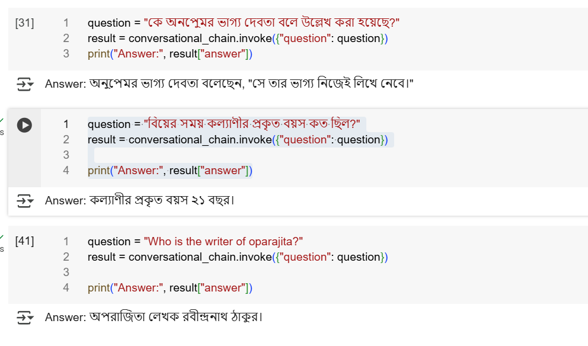

# Setup guide
- Clone the repository 
- Create a Virtual Environment
- Install Dependencies
- Give OpenAI API Key
- Run the script on Google Collab

# Tools:
Google Collab

# Libraries:
- HuggenFaceEmbeddings
- FAISS
- RetrievalQA 
- ChatOpenAI
- ContextualCompressionRetriever
- LLMChainExtractor
- ConversationBufferMemory
- ConversationalRetrievalChain
- pytesseract
- PromptTemplate

# Packages:
- langchain
- langchain_community
- langchain_core
- transformers
- sentence_transformers
- pypdf
- faiss_cpu
- gdown.

# Output

# QnA

1. Q-1:What method or library did you use to extract the text, and why? Did you face any formatting challenges with the PDF content? 

Answer: pytesseract,pdf2image was used to convert each page of the PDF into high-resolution images before running OCR.
Tesseract OCR supports Bangla very well with the ben language pack.The original PDF was a scanned document, not a text-based PDF, so traditional PDF parsers like PyPDF2 would fail to extract any meaningful text.pytesseract combined with pdf2image gave full control over OCR processing, enabling better quality output for each page.
Yes, I faced formatting challenge with PDF content.Characters were misrecognized, broken, or missing.The output text had formatting issues like random line breaks and junk symbols.

2. Q-2:What chunking strategy did you choose (e.g. paragraph-based, 
sentence-based, character limit)? Why do you think it works well for semantic retrieval? 

Answer: I split the text into chunks of about 1000 characters with some overlap (150 characters) using a character-based splitter RecursiveCharacterTextSplitter. This helps keep the context flowing between chunks, so the retrieval model better understands the meaning without missing important details.

3. Q-3 :What embedding model did you use? Why did you choose it? How does it capture the meaning of the text? 

Answer: I used the sentence-transformers/paraphrase-multilingual-MiniLM-L12-v2 embedding model from HuggingFace. This model is specifically designed to handle multiple languages, including Bangla, making it suitable for my multilingual OCR-extracted text.
I chose this model because it strikes a good balance between performance and efficiency — it produces high-quality sentence embeddings while being relatively lightweight and fast compared to larger transformer models. This is important for practical use when working with many text chunks.
The model works by transforming sentences into dense numerical vectors in a high-dimensional space where semantically similar sentences are mapped closer together. This way, even if the exact words differ, the model captures the underlying meaning and context of the text. These embeddings enable the retrieval system to find relevant chunks of text based on semantic similarity, improving the accuracy of answering questions from the document.

4. Q-4 :How are you comparing the query with your stored chunks? Why did you choose this similarity method and storage setup? 

Answer: I compare the user’s query by converting it into an embedding vector using the same multilingual model as the document chunks. Then, I use FAISS, a fast vector similarity search library, to find the top chunks whose embeddings have the highest cosine similarity with the query vector.
I chose cosine similarity because it effectively measures how close two vectors are in meaning, regardless of their magnitude. FAISS was selected for its efficiency and scalability in handling large embedding datasets, enabling quick and accurate retrieval of the most relevant document parts.

5. Q-5 :How do you ensure that the question and the document chunks are compared meaningfully? What would happen if the query is vague or missing context? 

Answer: To ensure meaningful comparison, both the question and document chunks are converted into embeddings using the same model, so their semantic meanings are captured in a shared vector space. This allows the system to match concepts and context rather than just exact words.
If the query is vague or lacks context, the retrieval may return less relevant chunks because the embedding won’t clearly represent the user’s intent. In such cases, the system might give generic or incomplete answers, highlighting the importance of clear, specific questions for best results.

6. Q-6 :Do the results seem relevant? If not, what might improve them (e.g. better chunking, better embedding model, larger document)?

Answer: The results seem relevant, but since I used the sentence-transformers/paraphrase-multilingual-MiniLM-L12-v2 model—which is relatively lightweight and general-purpose—there’s room for improvement. Using a more advanced or Bangla-specialized embedding model could help produce more accurate and precise answers.